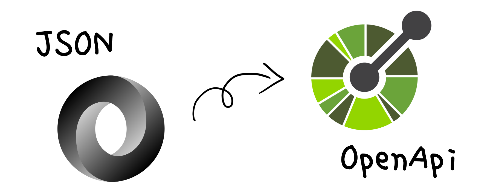

# A Kotlin library for converting Json-object into OpenAPI Schema

[](https://maven-badges.herokuapp.com/maven-central/io.github.drewlakee/jooas)

Converts a json object into an OpenAPI schema in YAML format



Supported types:
- arrays
- objects
- primitives

Features:
- values from json as example

```json
{
  "integer_value": 1,
  "object_value": {
    "a": 2,
    "b": "value"
  }
}
```

```yaml
Schema:
  type: object
  properties:
    integer_value:
      type: integer
    object_value:
      type: object
      properties:
        a:
          type: integer
        b:
          type: string
```

- object references and structural deduplication

```json
{
  "pagination": {
    "page": 1,
    "pages": 63,
    "per_page": 2,
    "items": 126,
    "urls": {
      "last": "https://api.discogs.com/artists/1/releases?page=63&per_page=2",
      "next": "https://api.discogs.com/artists/1/releases?page=2&per_page=2"
    }
  },
  "community": {
    "in_wantlist": 1451,
    "in_collection": 383
  },
  "releases": [
    {
      "id": 20209,
      "stats": {
        "community": {
          "in_wantlist": 1451,
          "in_collection": 383
        }
      }
    },
    {
      "id": 62584,
      "stats": {
        "community": {
          "in_wantlist": 830,
          "in_collection": 682
        }
      }
    }
  ]
}
```

```yaml
components:
  schemas:
    Schema:
      type: object
      properties:
        pagination:
          $ref: "#/components/schemas/Pagination"
        community:
          $ref: "#/components/schemas/Community"
        releases:
          type: array
          items:
            $ref: "#/components/schemas/Releases"
    Pagination:
      type: object
      properties:
        page:
          type: integer
          example: 1
        pages:
          type: integer
          example: 63
        per_page:
          type: integer
          example: 2
        items:
          type: integer
          example: 126
        urls:
          $ref: "#/components/schemas/Urls"
    Urls:
      type: object
      properties:
        last:
          type: string
          example: https://api.discogs.com/artists/1/releases?page=63&per_page=2
        next:
          type: string
          example: https://api.discogs.com/artists/1/releases?page=2&per_page=2
    Community:
      type: object
      properties:
        in_wantlist:
          type: integer
          example: 1451
        in_collection:
          type: integer
          example: 383
    Releases:
      type: object
      properties:
        id:
          type: integer
          example: 20209
        stats:
          $ref: "#/components/schemas/Stats"
    Stats:
      type: object
      properties:
        community:
          $ref: "#/components/schemas/Community"
```

Check specification rendering here: https://editor.swagger.io/

## Usage examples

```kotlin
fun main() {
    var adapter = AdaptersFactory.createObjectAdapter()
    val json = """
            {
              "name": "London",
              "region": "City of London, Greater London",
              "country": "United Kingdom",
              "lat": 51.52,
              "lon": -0.11,
              "tz_id": "Europe/London",
              "localtime_epoch": 1613896955,
              "localtime": "2021-02-21 8:42"
            }
    """
}
```

### Result at need

```kotlin
    val result: String = adapter.convert(json)
    println(result)
```

```yaml
Schema:
  type: object
  properties:
    name:
      type: string
    region:
      type: string
    country:
      type: string
    lat:
      type: number
    lon:
      type: number
    tz_id:
      type: string
    localtime_epoch:
      type: integer
    localtime:
      type: string
```

### Feature toggles for adapter

```kotlin
    adapter = AdaptersFactory.createObjectAdapter(
        Pair(Features.Feature.WITH_EXAMPLE, true)
    )
```

```yaml
Schema:
  type: object
  properties:
    name:
      type: string
      example: London
    region:
      type: string
      example: "City of London, Greater London"
    country:
      type: string
      example: United Kingdom
    lat:
      type: number
      example: 51.52
    lon:
      type: number
      example: -0.11
    tz_id:
      type: string
      example: Europe/London
    localtime_epoch:
      type: integer
      example: 1613896955
    localtime:
      type: string
      example: 2021-02-21 8:42
```